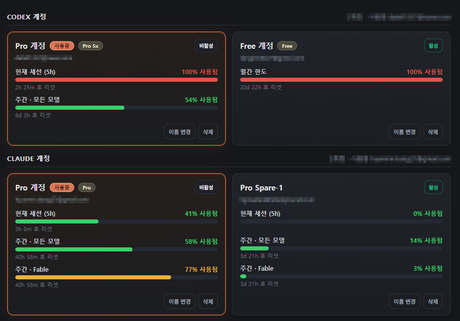

<p align="right">
  <a href="README.md"><b>English</b></a> ·
  <a href="README.ko.md">한국어</a>
</p>

<div align="center">

# LazySwitch

Stop doing the logout → login dance. When one account is spent, the next one takes over.

Windows tray app that keeps several **Codex** and **Claude** accounts enrolled locally, watches every usage window, and rotates to a spare account the moment the active one runs out — then brings your running CLI sessions back where they left off.

<p>
  <a href="#requirements"></a>
  <a href="#what-a-switch-does"></a>
  <a href="https://github.com/datell1357/LazySwitch/releases/latest"></a>
  <a href="#license-and-attribution"></a>
  <a href="https://github.com/datell1357/LazySwitch/stargazers"></a>
</p>

<p>
  <a href="#cli-session-handover"></a>
  <a href="#command-line"></a>
</p>

<p>
  
</p>

<sub>
  <a href="#install">Install</a> ·
  <a href="#first-run">First run</a> ·
  <a href="#what-a-switch-does">What a switch does</a> ·
  <a href="#cli-session-handover">CLI session handover</a> ·
  <a href="#settings">Settings</a> ·
  <a href="#command-line">Command line</a> ·
  <a href="#boundaries">Boundaries</a> ·
  <a href="#license-and-attribution">License</a>
</sub>

</div>

---

## Install

Download the installer from the [latest release](https://github.com/datell1357/LazySwitch/releases/latest) and run it:

**[⬇ LazySwitch-Setup-0.1.0.exe](https://github.com/datell1357/LazySwitch/releases/latest)**

It installs per-user (no admin prompt) and launches straight into the tray. There is no main window — everything hangs off the tray icon.

When reinstalling over an existing installation, the installer asks whether to delete the old settings and cache first. Enrolled accounts are never touched.

Windows SmartScreen will warn about an unsigned app. *More info → Run anyway*.

### Or Build It Yourself

```powershell
git clone https://github.com/datell1357/LazySwitch.git
cd LazySwitch
npm install
npm start        # build + launch the tray app
npm run dist     # build an installer into release/
```

---

## First Run

LazySwitch never asks for credentials. It moves the auth files the CLIs already wrote, so you log in the normal way and then hand the login over.

1. **Log in** to an account the usual way — `codex login`, or start `claude` and log in.
2. Open **Manage accounts…** from the tray, add the current/login account there, and give the slot a name (`Pro`, `Free`, `Spare-1`, …).
3. Log in as the next account, enroll it too. Repeat.
4. Open **Manage accounts…** from the tray to see every account, its plan, and how much of each window it has burned.

The tray menu does not list accounts or usage. Use **Manage accounts…** to open the account manager and switch accounts by hand. It also contains the tutorial, auto-restart toggles, **Show usage widget**, **Start at login**, language, and quit.

On first launch, the tutorial includes a usage-widget step with checkboxes for showing the widget and keeping it always on top, plus a minimized-position picker. Its final step has **Skip**, which closes the tutorial without opening the account manager.

Two accounts on a provider is the minimum for rotation to have anywhere to go.

### The Account Card

<p>
  
</p>

Each card shows two independent facts, side by side:

| Badge | Meaning |
|---|---|
| **In use** | the account the CLI and Desktop are authenticated as right now |
| **Enabled** | in the spare pool — rotation is allowed to switch to it |
| **Disabled** | still enrolled, still visible, but never rotated into |

They are independent: an account can be *in use* and *disabled as a spare* at the same time, and the card says so. The button beside the badges is the action (**Turn off** / **Turn on**), not the state.

Below the badges, every usage window the provider reports — the 5-hour session, the weekly total, per-model weeklies, monthly caps — with the reset time under each bar.

### The Usage Widget

The usage widget is a small window that is always on top by default. It appears after at least one account is enrolled and the first-run tutorial has been dismissed. It shows usage gauges for every enrolled account in separate **Codex** and **Claude** cards, with the active account first in each group. Toggle it from the tray menu with **Show usage widget**.

Drag the title bar to move it and any edge to resize it; its position and size are remembered. The gear button opens settings with an **Always on top** toggle, a **Minimized position** picker, and a list of hidden accounts that can be restored. Each account has a **Hide** button.

The minimize button collapses the widget into a compact strip with one line per active account, showing only the 5-hour and weekly gauges. The strip is locked in place and cannot be moved or resized; its position is controlled by **Minimized position**: on the taskbar next to the clock (default), bottom-right, or bottom-left. Right-click the strip for **Settings / Maximize / Close**.

If **Always on top** is turned off while the minimized position is **On the taskbar**, the position automatically changes to bottom-right and an on-screen notice explains why.

---

## What A Switch Does

When the active account's 5-hour or weekly window crosses its threshold, LazySwitch:

1. Saves the live auth back into its own slot, keeping any refreshed token.
2. Picks the next **enabled** account that still has room.
3. Atomically installs that account's auth as the live one.
4. Restarts Codex Desktop, if you asked it to — Desktop caches the old token in memory and will not notice the file change otherwise.
5. Hands over your running CLI sessions, if you asked it to. See below.

A popup asks before switching. Tick **Auto-approve switches** to let it rotate unattended.

```
~/.codex-accounts/<name>/auth.json    each enrolled Codex account, isolated
~/.codex/auth.json                    the LIVE Codex account (CLI + Desktop read this)

~/.claude-accounts/<name>/            each enrolled Claude account, isolated
~/.claude/                            the LIVE Claude account
```

Usage comes from each provider's own telemetry: Codex's `rate_limits` from the newest session rollout, Claude's usage API. A usage-limit **error** in the session stream is always a reactive backstop, so a switch still happens even if the percentages never arrive.

---

## CLI Session Handover

A switch invalidates the token every running `codex` / `claude` CLI is holding. **Auto-restart CLI** is on by default for both Codex and Claude; when enabled, LazySwitch finds those sessions and hands each one over:

1. Kills the CLI process.
2. Closes the shell it ran in, when that shell can be closed.
3. Reopens it in a **new terminal** on its own resume command — `codex resume <id>` / `claude --resume <id>`, resolved per session so every terminal comes back to its own conversation.

Detection is machine-wide. A `codex` in project A and a `codex` in project B are both handed over, each to its own directory and its own transcript.

Sessions living in an **Orca** tab reopen as a new Orca tab, and never spill a desktop console onto your machine. Everything else gets a Windows Terminal tab, or a PowerShell window when that cannot launch.

### What It Will Not Do

| Case | Behaviour |
|---|---|
| **In-flight work** | Lost. Resume restores the conversation transcript, not the turn that was running. |
| **Elevated terminals** | Left alone. An unelevated app cannot read an elevated process's working directory, cannot identify its transcript, and cannot kill it. Those sessions are reported as *manual* and the resume command is copied to your clipboard, to paste into that admin terminal yourself. |
| **Terminal emulators** | Never closed. Only real shells (`powershell`, `pwsh`, `cmd`, `bash`) are — a `wt.exe` may own tabs that have nothing to do with you. |

---

## Requirements

**Required**

- Windows 10 / 11
- Two or more accounts enrolled for whichever provider you want rotated

**Optional**

- Codex Desktop — only if you want it restarted on a switch
- Windows Terminal — used for reopened sessions when present; a PowerShell window is the fallback
- Orca — Orca-hosted sessions reopen as Orca tabs
- Node.js 18+ — only to build from source

**Not needed**

- Any API key. LazySwitch never asks you for a credential.

---

## Settings

Open **Manage accounts…** from the tray and use **Options**, or edit `%APPDATA%/LazySwitch/config.json` directly. Most keys are per provider.

| key | default | meaning |
|---|---|---|
| `autoApprove` | `false` | rotate without the approval popup |
| `autoRestartCli` | `true` | hand running CLI sessions over on a switch (Codex and Claude) |
| `desktopAppPath` | `""` | Codex Desktop exe or `shell:AppsFolder\…` AUMID (auto-detected if empty) |
| `primaryMinLeftPct` | `5` | switch when the 5-hour window has ≤ this % left |
| `weeklyMinLeftPct` | `1` | switch when the weekly window has ≤ this % left |
| `pollIntervalSec` | `30` Codex · `300` Claude | how often to check — Claude's usage API rate-limits below ~5 min |
| `rateLimitEndpoint` | `""` | optional authoritative rate-limit URL |
| `language` | `""` | UI language: `""` system, `ko` / `en` / `ja` / `zh` |

---

## Command Line

The tray app is the whole product, but the same numbers are available from a terminal:

```bash
lazyswitch status                    # print the account usage table once
lazyswitch watch --interval 30       # keep the table on screen
lazyswitch statusline                # one compact line per account
lazyswitch statusline claude         # …for a single provider
lazyswitch install-hooks             # Claude statusLine + Codex built-ins
```

`install-hooks` puts the usage line into Claude Code's status bar, so you can see the window burning down without leaving the CLI.

`statusline` prints one line per account, using the name you gave the slot (not its e-mail), its state, and fixed-width `5H` / `Week` / `Fable` gauges. The active account of each provider is listed first; Codex lines omit `Fable`. It adapts to the terminal width and drops reset-time text when the terminal is narrow.

```text
Claude Pro ACT 5H [  31% 2h47m ] Week [  90% 2h47m ] Fable [  99% 2h47m ]
티그       RST 5H [ 100% 1h17m ] Week [  39% 1h17m ] Fable [  12% 1h17m ]
Codex Pro  ACT 5H [   4% 6d0h  ] Week [   0% 6d0h  ]
```

From a source checkout, before installing:

```bash
npm run build
node dist/main/cli.js status
```

---

## Boundaries

LazySwitch does **not**:

- bypass, extend, or defeat any usage limit — it rotates between accounts you already own
- ask for, store, or transmit credentials; it moves auth files the CLIs wrote, on your machine only
- phone home. No server, no telemetry, no network call except each provider's own usage endpoint

Running several accounts to extend usage may conflict with the terms you agreed to. That call is yours.

### Status

- Proactive percentages depend on Codex emitting `rate_limits` locally, or a pinned `rateLimitEndpoint`. The reactive error backstop works either way.
- Windows first. macOS paths (`desktop.ts`, tray) are stubbed and untested.

---

## License And Attribution

MIT. See [LICENSE](LICENSE).

Codex and Claude are products of OpenAI and Anthropic respectively. LazySwitch is an independent tool, not affiliated with, endorsed by, or supported by either.
